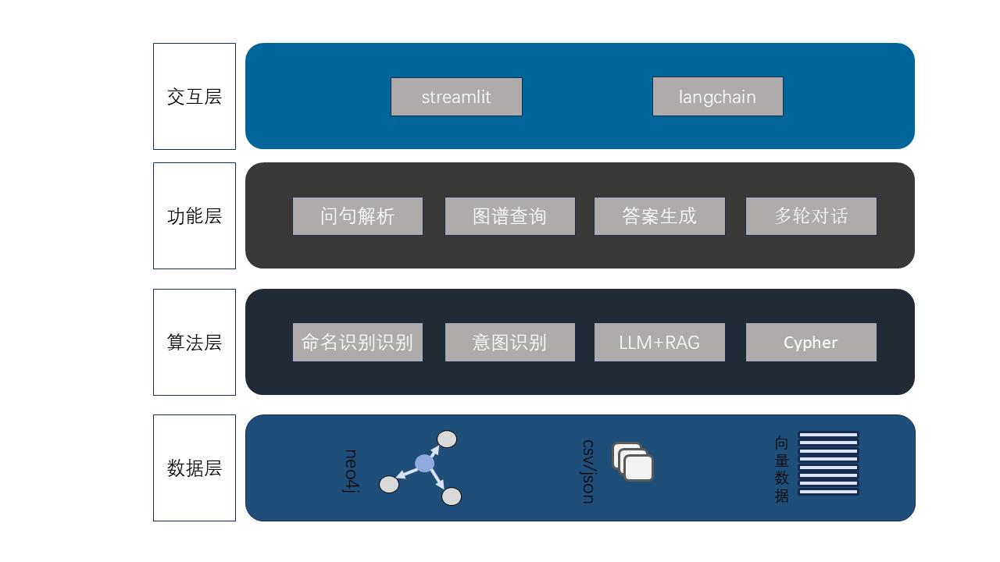

# 基于知识图谱的糖尿病问答系统

## 1. 项目介绍

针对传统医疗问答系统答案生成准确性不足、溯源性弱及专业性缺失等问题，本研究提出“知识图谱推理+大语言模型生成”的融合框架，构建糖尿病垂直领域智能问答系统。通过整合瑞金医院糖尿病数据集构建知识图谱（涵盖18类实体与15类关系），结合Qwen2.5-1.5B模型的LoRA微调实现实体识别，基于BERT + CNN的意图分类模型提升问句解析准确率。通过图谱结构化查询（单实体属性拓展查询、实体对直接间接关系验证及多跳关联推理）和RAG技术融合指南文献检索技术，将检索结果构建提示词，并结合LangChain框架集成LLM生成可解释性回答并使用streamlit实现可视化。实验表明，系统问句解析能力和回答专业性显著提升。实现疾病的命名实体识别F1值为81.03%，药物的命名实体识别F1值为 86.31%，意图分类的准确率为84.31%，F1值为73.38%。

整个项目构建并运行neo4j图谱后，再运行Web_demo.py即可使用。项目整体流程图如下：

对用户输入的问句进行解析，抽取出其中的关键词（实体）和意图（关系），再从已构建好的知识图谱中查询专业知识，与此同时，将问句通过RAG操作从已构建好的文档中查询相关知识，将专业知识与相关知识作为prompt提示大模型输出。

### 1.1 图谱构建

构建知识图谱的数据DiaKG数据集来源于阿里天池的瑞金医院MMC人工智能辅助构建知识图谱大赛，内部包含近19万中文医学实体的识别（包含药品、症状、疾病等类型）和6,890对实体关系，是近10年的糖尿病专家共识和权威指南文献。

依次读取数据集中所有的json文件，遍历每个文档块遍历每段每句，读取其中的实体和关系，并通过Cypher语法创建节点写入neo4j图形数据库。图谱构建结果如下：

实体信息如下：

| **Name**     | **解释**                                                     |
| ------------ | ------------------------------------------------------------ |
| Class        | 【类型】标注疾病的类型、状态、分期分型（如“2型糖尿病”中“2型”标注为Class） |
| Disease      | 【疾病】标注糖尿病及其并发症的名称                           |
| Reason       | 【病因】导致疾病的风险因素，如年龄、体重、家族史、其他疾病等（与发病机制区分）。 |
| Pathogenesis | 【发病机制】疾病发生时的体内病理变化过程（如激素失衡、细胞破坏等）。 |
| Symptom      | 【临床表现】标注患者主观症状（如食欲不振）和医生观察的体征（如皮疹）。 |
| Test         | 【检查方法】标注实验室、影像学等具体检查手段（如尿常规、MRI）。 |
| Test_items   | 【检查指标】标注检查中的具体小项（如血糖、HbA1c）            |
| Test_Value   | 【检查指标值】标注检查结果的数值、单位或文字描述（如“<3.3 mmol/L”“阳性”）。 |
| Drug         | 【药物】具体药物名称或类别（如格列吡嗪、抗生素），泛化名称（如“抗糖药”）不标注 |
| Frequency    | 【用药频率】用药频次（如“bid”“q6h”）                         |
| Amount       | 【用药剂量】药物剂量数值和单位（如“500mg/d”）                |
| Method       | 【用药方法】给药方式（如口服、肌肉注射）                     |
| Treatment    | 【非药治疗】非药物干预措施（如饮食控制、放疗）。             |
| Operation    | 【手术】具体手术方式（如胰岛细胞移植），泛化名称（如“手术治疗”）不标注 |
| ADE          | 【不良反应】药物或手术导致的异常反应（如药物引起的皮疹）     |
| Anatomy      | 【部位】疾病相关的人体部位（如β细胞、胰岛）                  |
| Duration     | 【持续时间】主要是指症状持续时间，也包括用药持续时间等信息   |
| Level        | 【程度】包括病情严重程度，治疗后缓解程度等                   |

关系信息如下：

| **Name**                         | **连接节点1** | **连接节点2**        |
| -------------------------------- | ------------- | -------------------- |
| 【检查方法】Test_Disease         | Disease       | Test_Disease         |
| 【临床表现】Symptom_Disease      | Disease       | Symptom_Disease      |
| 【非药治疗】Treatment_Disease    | Disease       | Treatment_Disease    |
| 【药品名称】Drug_Disease         | Disease       | Drug_Disease         |
| 【部位】Anatomy_Disease          | Disease       | Anatomy_Disease      |
| 【病因】Reason_Disease           | Disease       | Reason_Disease       |
| 【发病机制】Pathogenesis_Disease | Disease       | Pathogenesis_Disease |
| 【手术】Operation_Disese         | Disease       | Operation_Disese     |
| 【分期分型】Class_Disease        | Disease       | Class_Disease        |
| 【检查指标】Test_Items_Disease   | Disease       | Test_Items_Disease   |
| 【用药频率】Frequency_Drug       | Drug          | Frequency_Drug       |
| 【持续时间】Duration_Drug        | Drug          | Duration_Drug        |
| 【用药剂量】Amount_Drug          | Drug          | Amount_Drug          |
| 【用药方法】Method_Drug          | Drug          | Method_Drug          |
| 【不良反应】ADE_Drug             | Drug          | ADE_Drug             |

### 1.2 问句解析

（1）实体识别

命名实体识别的训练数据集为DiaKG数据。在数据集处理方面，首先遍历数据集内所有json文件，解析句子及其实体标注，再采用BIO标注体系生成命名实体识别的标签，按实体长度降序处理避免标注冲突和重叠，通过Qwen2.5-1.5B 的tokenizer的offset_apping进行切割将字符级标签对齐到token级，并采用有效性检查来过滤越界实体（例如部分实体结束索引超出文本长度的情况）。

在模型训练方面，本任务使用Qwen2.5-1.5B模型进行LoRA微调以实现命名实体识别任务。型训练启用FP16精度加速计算，独立保存LoRA适配器权重，训练最后将LoRA权重合并到基础模型，生成完整可部署模型。LoRa超参数信息表如下：

模型训练采用余弦衰减（Cosine Decay）结合线性预热（Linear Warmup）的动态学习率调度策略，旨在优化模型训练的收敛过程。在模型训练预热阶段（前10%的步骤），学习率线性增长，在余弦衰减阶段按照衰减公式进行学习率衰减。

（2）意图识别

意图识别可以抽象为中文文本分类任务。通过BERT + CNN模型进行训练或者微调后的模型对输入的文本（问句）进行预测，实现文本分类任务（意图识别）。将识别的意图映射到图谱中已有的关系，再结合识别到的实体，进行知识图谱查询。

### 1.3 图谱查询

图谱查询流程图如下：

### 1.4 可视化

系统架构图如下：

（1）图谱查询界面

（2）问答界面：

## 2. 运行环境

| **配置**     | **信息**/**版本** |
| ------------ | ----------------- |
| python       | 3.9.21            |
| torch        | 2.5.1             |
| torchvision  | 0.20.1            |
| Cuda         | 11.8              |
| transformers | 4.47.1            |
| tokenizers   | 0.21.1            |

## 3. 代码介绍

- function/assess

存放模型评估结果

- function/data

存放数据集

- function/model_train

存放模型训练代码，包含实体识别（NER）和文本分类（TC）模型的训练代码。

- models

存放原始模型，应当包含：bce-embedding-base_v1、bert-base-chinese、bert-large-uncased、chinese-electra-large-generator、DeBERTa-base、Qwen2.5-1.5B。文件过大，没有上传，只上传了目录。

- saved_models

保存微调或者训练后的模型。

- KG.py

读取数据构建知识图谱。

- Web

Web开头的文件为streamlit可视化的文件。在web_demo.py文件启动即可使用本系统。

## 4. 工作进度

- 2025.6.12

完成readme和代码上传

- 2025.4.22

上传服务器中的代码。