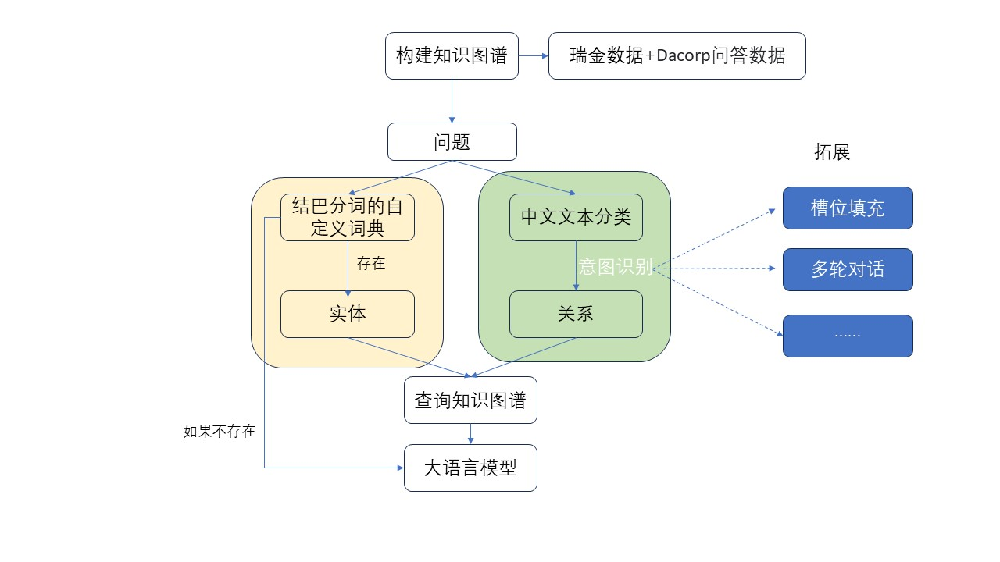
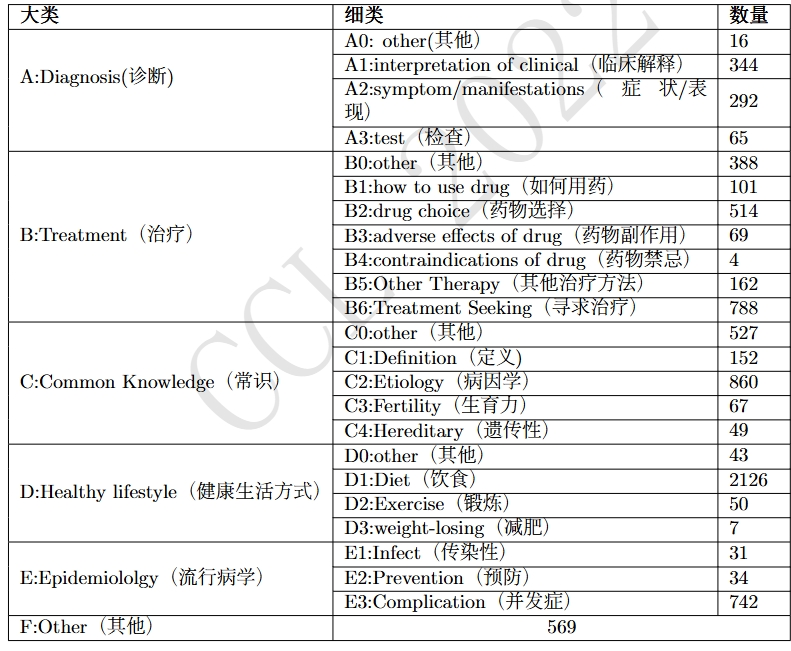

# 基于知识图谱的糖尿病问答系统

## 1 项目介绍

知识图谱是目前自然语言处理的一个热门方向。本项目是立足医药领域，以天池瑞金数据集和Dacorp问答数据为基础使用`neo4j`构建知识图谱并完成问答系统。目前项目主体思路如下：

**知识图谱**选用天池瑞金数据集，读取json文件进行构建KG。

**命名实体识别**选择`jieba`分词构建自定义字典，对问句query进行识别。

**意图识别**抽象为基于`bert`的中文文本分类任务。共有23个意图label。如图所示：

具体内容可以参考 [doc目录下2022.ccl-1.36.pdf](..\doc\2022.ccl-1.36.pdf) 或者Dacorp数据集相关论文-[中文糖尿病问题分类体系及标注语料库构建研究](https://aclanthology.org/2022.ccl-1.36/)。

- **重要提示**

bert模型（例如：`bert-base-chinese`）和训练好的模型（例如：`saved_model`）都在本地。文件过大没有上传。

## 2 运行环境

| environment |      version      |
| :---------: | :---------------: |
|   Windows   |        11         |
|   Python    |        3.9        |
|   pytorch   |       2.4.1       |
|    model    | bert-base-chinese |
|    neo4j    |      社区版       |
|     LLM     |   chatglm-flash   |

 

## 3 代码解释

- entity.py 

用于命名实体识别和构建jieba自定义字典。

- intent_detection.py

用于训练模型进行意图识别，将识别出的意图对应到图谱的关系，进行检索。

其中，`train_model`函数可以对模型进行训练，并将训练数据（损失、准确率等信息）写入Excel（文件要存在，这里用的是test.xlsx）。

- KG.py

读取data目录下的json文件从而构建知识图谱。

- QA_system.py

问答系统的主程序，在这里运行整个QA系统。

- ack_LLM.py

单独调用LLM用于测试。

- selfDefine.txt

自定义字典，用于命名实体识别。

## 4 工作进度

- 2025.3.2

修改模型训练部分代码

项目已完成，暂无更新。

